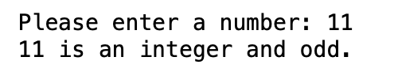
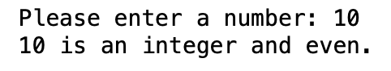
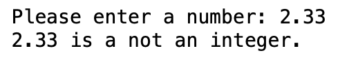

## Assignment 2
### Due: September 8, 2020 by 11:59pm

For this assignment, you will have to write a program that takes input from the user. You will have to assume the input is of the type float. Then you will have to determine whether the float number is in fact an integer. If it is an integer, you will also have to determine if the number is odd or even. Sample outputs have been given below.

* example 1:

* example 2

* example 3

Notes:

* Your output format **MUST** match the example outputs shown.
* In the examples shown, the first line is the prompt, asking the user to enter something. User is supposed to enter a number at that time. The number can be an integer or a float. The second line represents the output of the program.
* Notice that, in the output, if an integer is shown, there is no floating *.0* after the number.
* If the output is a float, then the number is shown as it is.
* You cannot use any functions except the ones built into Python3.
